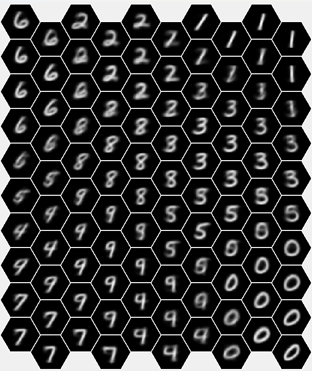
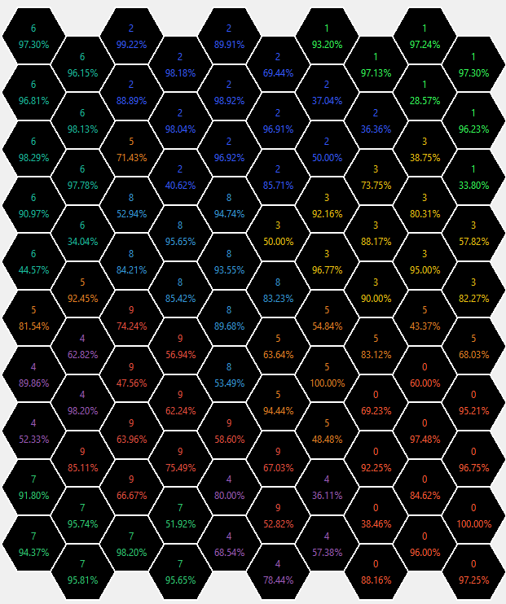

# SOM Digit Clustering

## Description

This project implements a Self-Organizing Map (SOM) for clustering and visualizing 28x28 grayscale digit images.

The model learns to group similar digits together using unsupervised learning and presents the results as a 2D map.


## Dataset

The dataset contains digit images (0–9) used for unsupervised clustering.

Each image represented as a 28x28 grayscale image, flattened into a vector of length 784.

Each value is in the range [0, 255], representing pixel intensity.


## How it works

The SOM algorithm follows these steps:

1. Initialize a grid of neurons (each neuron is a vector of size 784)
2. For each input vector:
  -   Find the Best Matching Unit (BMU) using Euclidean distance
  -   Update the BMU to become closer to the input
  -   Update its neighbors with a smaller learning rate
3. Repeat for multiple iterations

This process allows the model to organize similar inputs into nearby regions on the grid.

---

## Model Details

- Grid type: Hexagonal
- Number of neurons: 100
- Input size: 784 (28x28 images)

### Initialization

Neurons are initialized by averaging grouped samples (using modulo) to capture shared patterns, such as the common dark background surrounding the digits.

### Learning Rate
- Initial value: 0.3
- Decreases over time (divided each iteration) to produce clearer and more stable digit representations.

### Neighbor Updates
- First layer neighbors: moderate update
- Second layer neighbors: smaller update

---

## Score Calculation

The model is evaluated using a combination of:
- Euclidean distance (input vs BMU)
- Topological distance (distance between closest neurons)

The final score is normalized to the range [0, 100], where higher values indicate better clustering quality.

---

## Results

The model successfully clustered similar digits into coherent regions.

- Similar digits appear close together
- High purity values
- Smooth transitions between similar digits

Best score achieved: ~88.7

These results demonstrate the ability of SOM to capture underlying structure in the data without supervision.

---

## Visualization

The results are visualized using two complementary grids:

### Learned digit representations

<p align="center">
  
</p>

This grid shows the learned digit representations.

### Dominant digit and purity

<p align="center">
  
</p>

This grid shows the dominant digit and purity percentage for each neuron.

---

## Report

For a detailed explanation of the implementation, experiments, and results, see the full report:

👉 [Final Report](Final_Report.pdf)

---

## Insights

- SOM successfully groups similar digit patterns without labels
- Neighbor updates help maintain smooth transitions across the grid

---

## How to Run

### Requirements

- Python 3.x
- pandas
- numpy
- tkinter (for GUI visualization, included in most Python installations)

### Steps

1. Clone the repository:
```bash
git clone https://github.com/NopharGlo/SOM-Digit-Clustering.git
cd SOM-Digit-Clustering
```

2.Install dependencies:
```bash
python3 -m pip install pandas numpy
```

> Note: If tkinter is not installed, it may need to be installed separately depending on your system.

3. Run the project:
```bash
python3 main.py
```

The program will train the SOM and display the visualization results.

> Note: The execution may take up to one minute due to the training process. Please wait until the results are displayed.
